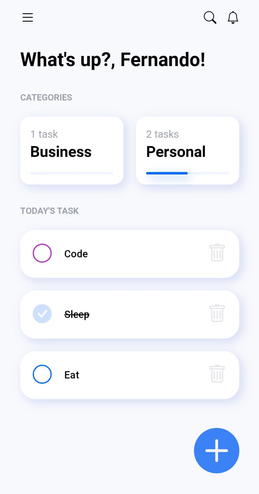
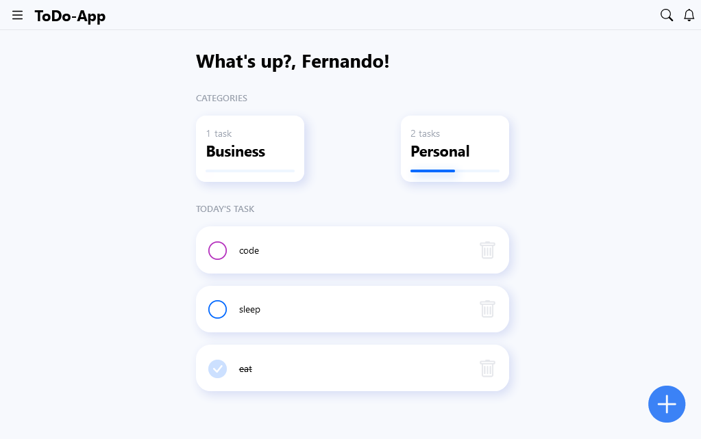

# Test Frontend - UI/UX - 2

This is a solution for the technical test required by a company in the selection process for the position of software developer.

## Table of contents

- [Overview](#overview)
  - [The challenge](#the-challenge)
  - [Screenshot](#screenshot)
  - [Links](#links)
- [My process](#my-process)
  - [Built with](#built-with)
- [Author](#author)

## Overview

### The challenge

The following exercise consists of creating a "to-do list".

The interface should allow the following actions on a task:

- Create
- Mark as resolved
- Delete

The interface should be based on the following mockup:

[ToDo-App Design](https://dribbble.com/shots/14100356-ToDo-App-UI)

PD:

It should be a web interface.
You can carry out the practice using basic tools
- HTML / JS / CSS

Alternatively, if you prefer, you can use a JavaScript framework.
- Preferred:
    - Vuejs + Vuetify
    [Vuejs](https://vuejs.org/)
    [Vuetify](https://vuetifyjs.com/en/)

    - React + MUI
    [React](https://reactjs.org/)
    [MUI](https://mui.com/)

### Screenshot

### Links

- Solution URL: [Github](https://github.com/SFCC5555/test-frontend-ui-ux-2)
- Live Site URL: [ToDo-App](https://todo-app-sfcc.netlify.app/)

## My process

### Built with

- Semantic HTML5 markup
- CSS custom properties
- Flexbox
- CSS Grid
- Mobile-first workflow
- JavaScript
- Sass
- Tailwind
- Bootstrap icons
- React Router V6
- [React](https://reactjs.org/) - JS library

## Author

- [Website](https://sfcc5555.netlify.app/)
- [LinkedIn ](https://www.linkedin.com/in/fernando-carrasco-dev/)
